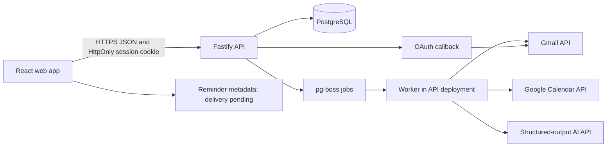
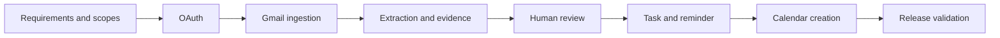

# Action Inbox — Project Execution Plan

Status: local web P0 implementation candidate; connected-planner direction approved 2026-10-07. One user's real Google sign-in/import is reported; all-user/deployment acceptance, approved paid-model evaluation, and reminder-delivery decision remain open.
Course: MSCS2101-1 Software Engineering, Fall 2026  
Team: four members; Member 1 is the primary software engineer  
Target: browser-first course MVP and live demonstration on December 5, 2026

## 1. Operating constraints

- Authoritative source and sanitized technical documentation are maintained in the private repository `kim-913/mscs2101`; local work remains in `/Users/ziruoke/Project/mscs2101`, with course artifacts also maintained in the team's dedicated Google Drive folder.
- Do not create, publish, or connect a public GitHub repository until the team explicitly decides to do so.
- Do not submit, post, message, or modify anything in Canvas without the user’s explicit confirmation for that specific action.
- Do not use browser UI automation for Canvas, Google Drive, or Google Docs. Use the authenticated local Google Workspace MCP integration; any unavoidable interactive sign-in must use the user's default Arc browser.
- Private GitHub publication was authorized on 2026-10-08. Follow the canonical branch/PR policy in [CONTRIBUTING.md](CONTRIBUTING.md); public publication remains unauthorized.
- The application is a classroom web MVP for four named test users, not a public release.
- The team will use Google OAuth testing mode and pre-register all test accounts.
- The product is browser-first, using React. Native mobile builds and Expo are outside the revised platform scope.

## 2. Product decision

**Working title:** Action Inbox

Action Inbox is a source-linked connected planner. Consented imports feed an internal calendar/agenda with short descriptions, action items, due dates where supported, and original-source details. Automatically displaying an internal suggestion is not approval of a task and never authorizes an external calendar write.

### Product outcome

A user connects an available source, receives a bounded automatic import after consent, and sees supported dated items alongside a clearly labelled undated/review list. Proposed actions, approved/manual tasks, and existing external Calendar events stay distinct; event start times and message receipt times are not inferred deadlines. Due urgency is a transparent date comparison, not AI confidence or a claim about personal importance.

Gmail and Google Calendar are the only currently configured provider capabilities, using the same Google connection. Outlook and Canvas are approved Phase 2 roadmap goals, not implemented or available connectors; official API permissions and missing setup prerequisites are in `docs/testing/connector-prerequisites.md`. Do not add pretend connection controls. Native structured assignment deadlines can eventually bypass AI, while unstructured Gmail action/deadline extraction still needs a configured, explicitly authorized extractor.

The local application keeps AI API extraction disabled. Imported messages remain readable, but import alone does not classify them or invent actions/dates. The separate one-case ChatGPT website experiment is neither a backend integration nor a schema/accuracy acceptance pass.

### Primary demonstration scenario

1. A test account receives an email requesting registration documents by a specific Friday.
2. The user consents to Google connection; a bounded initial Gmail import starts automatically. Later refresh/retry is explicit.
3. With an explicitly approved, configured extractor, Action Inbox classifies the message as `Action Required`.
4. It displays a proposed action/deadline in the internal planner with the exact supporting quotations. With extraction disabled, it instead exposes the readable message and truthful unavailable-extraction state.
5. The user edits or approves the proposal.
6. The application creates an internal task and optional Google Calendar event/reminder.
7. Re-synchronizing does not create duplicates.
8. The task moves from `Pending` to `Waiting for Reply` or `Completed` while retaining its source-email link.

## 3. Delivery scope

### P0 — required for the final demonstration

- Google OAuth for one Google account per user.
- Gmail read-only synchronization, limited to the most recent 14 days or 100 messages per run.
- Categories: `Action Required`, `Read / Review`, and `Reference`.
- Structured AI extraction of action, explicit deadline, confidence, and supporting quotation.
- Server-side validation that supporting quotations occur in the source email.
- Internal planner display may show proposed suggestions automatically. Review, edit, approve, and reject remain required before suggestion-to-task conversion; external Calendar creation always needs separate explicit confirmation.
- Internal tasks with `Pending`, `Waiting for Reply`, and `Completed` states.
- Manual task and reminder creation.
- Reminder creation, editing, and cancellation metadata remain required. Delivery while the browser is closed is pending an explicit product decision; local Expo notifications are no longer an applicable implementation.
- Upcoming Google Calendar event display and user-approved event creation.
- Source-email linkage for every extracted task.
- Idempotent synchronization and duplicate prevention for messages, suggestions, tasks, and events.
- User-visible synchronization/error state; failures must not silently discard data.
- A deterministic test mailbox and demonstration script.
- Automated quality gates and evidence for requirements, design, testing, security review, and code review.

### P1 — implement only after every P0 acceptance criterion passes

- Search and filters.
- Configurable reminder lead time.
- Bulk review of low-risk `Reference` classifications.
- Lightweight sync history screen.
- Additional responsive web presentation polish.

### Phase 2 — approved incremental roadmap, not current completion

The user approved gradually extending the internal, Google-Calendar-like planner rather than requiring an external calendar. Detailed requirements and acceptance boundaries are maintained in `docs/requirements/phase-2.md`.

1. Connect Outlook and Canvas through their official APIs after approved application/institution configuration and source-specific consent. Automatically import supported assignments and other source items with short descriptions, action items, dates, provenance, and source details; never scrape private browser sessions.
2. Extend the internal calendar/agenda so due assignments, immediate-action work, flights, and other time-sensitive items have distinct date semantics and readable details. Native structured dates do not depend on paid AI; unstructured extraction remains subject to evidence and cost approval.
3. Add explicitly opted-in notification choices, including reminders one or two days before assignments and appropriate immediate/time-sensitive alerts. Define permissions, browser-closed delivery, timezone changes, deduplication, cancellation, and observed delivery before claiming success.
4. Evaluate SMS as an optional separately approved channel. This roadmap does not authorize a paid SMS account, phone-number collection, sending a message, provider registration, or spending. No enabled-looking SMS/notification controls should appear before real delivery exists.

These goals do not silently pass or replace P0 AC-09: the existing reminder-delivery release criterion remains unresolved until its mechanism or replacement acceptance criterion is explicitly approved and verified. Current reminder controls store metadata only.

#### Approved Canvas calendar-only increment

After confirming Sofia Canvas exposes Calendar Feed, the user explicitly chose an ongoing read-only calendar subscription as the first Canvas connection. This is not a substitute claim for full Canvas OAuth: private course, grade, submission and completion APIs still require future setup/consent. The implementation accepts the secret link only through authenticated app input, encrypts it server-side, imports native assignment due/event dates without AI, and supports initial/manual refresh with source-specific paging and last-success retention. After the identified-client transport correction was deployed, the user reported their real feed import working; no private item count/content was inspected to reconfirm it. See `docs/testing/canvas-subscription-evidence.md`.

No imported item automatically creates an approved task, writes an external calendar, or delivers a notification. Date-only assignment feeds cannot establish an exact due clock time. The source has bounded date coverage; the app rejects more than 1,000 events instead of silently truncating. Disappearance from a snapshot is not completion. Full Outlook/Canvas OAuth and reminder channels remain planned, and AC-09 remains unchanged.

### Explicitly deferred

- Public OAuth verification or public app-store distribution.
- Continuous mobile background synchronization.
- Notification transport deployment until the Phase 2 mechanism, permissions, and any cost are separately approved.
- Attachments, OCR, or attachment-derived deadlines.
- Exchange-specific behavior or multiple Google accounts beyond the approved Phase 2 Outlook/Canvas goals.
- Automatic approved-task creation or external Calendar writes without review; internal proposed-item display is allowed.
- Full bidirectional task synchronization.
- Recurring-event authoring.
- Shared/team task management.
- Custom model training.

If schedule pressure occurs, cut P1 first. Do not weaken approval, evidence, duplicate prevention, token security, or the core end-to-end path.

## 4. Measurable acceptance criteria

| ID    | Requirement                           | Acceptance evidence                                                                                                                                                                              |
| ----- | ------------------------------------- | ------------------------------------------------------------------------------------------------------------------------------------------------------------------------------------------------ |
| AC-01 | Account connection                    | Each of the four approved test users can complete OAuth and reconnect after an expired access token.                                                                                             |
| AC-02 | Gmail synchronization                 | A run imports up to 100 messages from the configured 14-day window and records success or an actionable error.                                                                                   |
| AC-03 | Idempotency                           | Running the same synchronization three times produces one stored email and at most one active suggestion per extracted action.                                                                   |
| AC-04 | Human approval                        | No task or Google Calendar event is created before an explicit approval action.                                                                                                                  |
| AC-05 | Evidence                              | Every AI-derived action or deadline displays a quotation that is verified as part of the normalized source body.                                                                                 |
| AC-06 | Deadline safety                       | An uncertain or unsupported deadline is flagged for review rather than silently treated as exact.                                                                                                |
| AC-07 | Task lifecycle                        | A user can create, edit, reject, approve, complete, and mark a task as waiting for reply.                                                                                                        |
| AC-08 | Calendar creation                     | An approved event is created once, stores the Google event ID, and is not duplicated after retry.                                                                                                |
| AC-09 | Reminders (delivery decision pending) | A user can create and cancel reminder metadata for an approved task. The replaced native-notification criterion is not complete; browser-closed delivery requires a separate approved mechanism. |
| AC-10 | Accuracy                              | On a versioned, anonymized 50-message evaluation set: action-required recall is at least 90%, explicit-deadline precision is at least 90%, and all misses are documented.                        |
| AC-11 | Security                              | OAuth tokens and email bodies never appear in application logs; refresh tokens are encrypted at rest.                                                                                            |
| AC-12 | Resilience                            | A Gmail, Calendar, or AI failure leaves the last successful data readable and exposes a retryable error.                                                                                         |
| AC-13 | Performance                           | With 100 synchronized messages, the populated dashboard becomes interactive within 2 seconds in the designated demo browser after API data is available.                                         |
| AC-14 | Traceability                          | Each P0 requirement maps to at least one test and one final report section.                                                                                                                      |

## 5. Technical architecture

### Selected stack

| Area                   | Choice                                                                                                                                       | Reason                                                                                                |
| ---------------------- | -------------------------------------------------------------------------------------------------------------------------------------------- | ----------------------------------------------------------------------------------------------------- |
| Web client             | React + TypeScript + Vite                                                                                                                    | Browser-first application with a small build system and responsive layouts.                           |
| Client state/data      | TanStack Query; local component state; Zod validation                                                                                        | Clear server-state ownership without a global-state framework.                                        |
| API                    | Node.js LTS + TypeScript + Fastify                                                                                                           | Small, typed, testable HTTP service with low framework overhead.                                      |
| Database               | PostgreSQL hosted in Supabase for staging/demo                                                                                               | Durable relational constraints and a managed course deployment. Supabase Auth is not required.        |
| Database access        | Drizzle ORM and SQL migrations                                                                                                               | Typed access while keeping schema and generated SQL reviewable.                                       |
| Job processing         | `pg-boss` backed by PostgreSQL                                                                                                               | Retryable sync/extraction work without operating Redis.                                               |
| AI extraction          | OpenAI Responses API structured output behind an `Extractor` interface                                                                       | Schema-constrained output and a replaceable provider boundary.                                        |
| Google integration     | Gmail API and Google Calendar API via backend-owned OAuth flow                                                                               | Tokens remain off the device and integration behavior is centralized.                                 |
| Canvas calendar feed   | Maintained iCalendar parser behind pinned Sofia HTTPS, encrypted per-user subscription and bounded snapshots                                 | Native calendar dates without AI; explicit calendar-only consent, no provider writes.                 |
| Reminders              | Durable reminder metadata; delivery decision pending                                                                                         | No claim of reliable closed-browser delivery and no unapproved push/email infrastructure.             |
| Unit/integration tests | Vitest, React Testing Library, PostgreSQL test database                                                                                      | Fast deterministic tests around behavior and constraints.                                             |
| End-to-end smoke       | Local Playwright/browser tooling on the designated browser                                                                                   | Exercises the actual web interaction path; no Google UI writes.                                       |
| Quality/security       | TypeScript strict mode, ESLint, Prettier, full PostgreSQL tests, isolated web build in GitHub CI; separate dependency/secret/security review | `Quality gate` is the merge-policy check; additional security tools are not implied to be configured. |

### Runtime topology



For the classroom deployment, the API and worker may run in one service process. Their modules remain separate so jobs can move to a dedicated worker without changing contracts.

### Google OAuth and browser session flow

1. The web app obtains a browser-bound CSRF token and asks the API for an authorization URL.
2. The API validates the exact configured web origin, creates short-lived single-use hashed state and encrypted PKCE material, and binds the flow to an HttpOnly cookie.
3. The browser navigates to Google, which redirects only to the registered backend callback.
4. The API atomically consumes valid state, verifies the browser binding, exchanges the code, and encrypts provider tokens.
5. The API issues an opaque application session cookie; only its hash is stored server-side. The cookie is HttpOnly, SameSite=Lax, and Secure outside local HTTP development.
6. The callback redirects only to the configured web application origin. Credentials never enter application URLs, JavaScript storage, or response JSON.
7. The refresh endpoint rotates the current server session and cookie; no separate refresh bearer token exists. Logout, disconnect, and deletion invalidate relevant server-side state.
8. All state-changing application requests require an exact allowed Origin and a session-bound CSRF token. CORS allows only the configured web origin with credentials, never wildcard origins.

Requested access is limited to identity, Gmail read-only, and the Calendar event access needed for the primary calendar. Exact Google scopes are recorded in an ADR before implementation. Native deep links and app-code exchange are removed from the revised architecture.

### Security and privacy invariants

- Treat email subjects and bodies as untrusted input, including prompt-injection text.
- The AI integration has no tools and cannot perform application actions.
- Never create a task/event based solely on model output; persist it as a reviewable suggestion.
- Encrypt Google refresh/access tokens and PKCE verifier with AES-256-GCM using a deployment secret outside the database.
- Do not log authorization headers, cookies, OAuth URLs/codes, tokens, email bodies, or AI prompts.
- Verify evidence quotations against normalized email text before displaying an extraction as supported.
- Use parameterized queries, strict request schemas, bounded batch sizes, and per-user authorization checks.
- Provide disconnect/delete behavior that revokes Google access and removes retained message content.
- Store only the normalized body needed for evidence and demonstration; do not store attachments.

## 6. Proposed repository layout

No source directories are created until this plan is accepted.

```text
mscs2101/
├── EXECUTION_PLAN.md
├── README.md
├── .env.example
├── package.json
├── apps/
│   └── web/
├── services/
│   └── api/
├── packages/
│   └── contracts/
├── database/
│   └── migrations/
├── docs/
│   ├── proposal/
│   ├── requirements/
│   ├── architecture/
│   ├── adr/
│   ├── testing/
│   ├── security/
│   ├── reviews/
│   └── final/
└── test-data/
    └── anonymized/
```

Use npm workspaces. Avoid a monorepo orchestration framework unless measured build time later justifies it.

## 7. Domain and data model

### Core records

| Record                 | Essential fields and constraints                                                                                                                                       |
| ---------------------- | ---------------------------------------------------------------------------------------------------------------------------------------------------------------------- |
| `users`                | `id`, email, display name, timezone, timestamps; normalized email unique.                                                                                              |
| `google_connections`   | user ID unique, Google subject unique, encrypted access/refresh tokens, expiry, scopes, revocation state.                                                              |
| `oauth_states`         | hashed state, PKCE verifier, expiry, consumed timestamp; single use.                                                                                                   |
| `sync_runs`            | user, source, status, cursor before/after, counts, safe error code, timestamps.                                                                                        |
| `email_messages`       | user, Gmail message/thread IDs, sender, subject, received time, normalized body, body hash; `(user_id, gmail_message_id)` unique.                                      |
| `extraction_runs`      | email, extractor version, prompt/schema version, result status, model metadata, timestamps.                                                                            |
| `suggestions`          | email, category, action title, due time, confidence, evidence quote/offsets, review state, deterministic fingerprint.                                                  |
| `tasks`                | user, source suggestion nullable, title, due time, status, approved timestamp, completed timestamp, version.                                                           |
| `reminders`            | task, in-app due time, active/cancelled state; no delivery identifier until the delivery mechanism is approved. This metadata does not constitute delivered reminders. |
| `calendar_event_links` | task, calendar ID, Google event ID, request idempotency key; task and Google event ID unique.                                                                          |
| `job_records`          | supplied by `pg-boss`; retry policy and terminal failure remain visible through `sync_runs`.                                                                           |

### State transitions

- Suggestion: `Proposed -> Approved | Rejected`; an approved suggestion may be edited before task creation as one atomic operation.
- Task: `Pending <-> Waiting for Reply`; either may transition to `Completed`; completion may be reversed to `Pending`.
- Sync run: `Queued -> Running -> Succeeded | Failed`; stale `Running` jobs become retryable failures.
- Calendar link: `Requested -> Created | Failed`; retries reuse the same idempotency key.

All ownership checks use the authenticated user ID on the server. Client-supplied user IDs are never authoritative.

## 8. API boundary

Initial versioned endpoints:

- `GET /v1/auth/session` (browser session and CSRF token; never bearer credentials)
- `POST /v1/auth/google/start`
- `GET /v1/auth/google/callback`
- `POST /v1/auth/refresh` (rotates the current opaque HttpOnly server session; no separate refresh credential)
- `POST /v1/auth/logout`
- `POST /v1/connections/google/disconnect`
- `POST /v1/sync/gmail`
- `GET /v1/sync-runs/:id`
- `GET /v1/inbox?category=&reviewState=&cursor=`
- `GET /v1/emails/:id`
- `PATCH /v1/suggestions/:id`
- `POST /v1/suggestions/:id/approve`
- `POST /v1/suggestions/:id/reject`
- `GET /v1/tasks?status=&cursor=`
- `POST /v1/tasks`
- `PATCH /v1/tasks/:id`
- `POST /v1/tasks/:id/reminders`
- `PATCH /v1/reminders/:id`
- `DELETE /v1/reminders/:id`
- `GET /v1/calendar/upcoming`
- `POST /v1/tasks/:id/calendar-event`
- `DELETE /v1/account/data`

The shared `packages/contracts` package owns request/response schemas. API errors contain a stable code, a safe user message, and a request ID; they never expose provider payloads or secrets.

Retrying `POST /v1/sync/gmail` reprocesses failed extractions for already stored messages without overwriting approved/rejected suggestions. A run containing an extraction failure must expose a failed status and safe actionable error, not silently report success. Inbox email records expose extraction status/error, independently of retained last-success data.

## 9. AI extraction contract

Input:

- Subject, sender display/domain, received timestamp, user timezone, normalized plain-text body.
- No attachments and no prior thread content beyond the synchronized message in the MVP.

Structured output:

- `category`: one of the three product categories.
- `categoryConfidence`: 0–1.
- `actions[]`: title, optional exact due timestamp, deadline certainty, supporting quotation, and action confidence.
- `needsReview`: boolean and machine-readable reason.

Post-processing:

- Reject unknown fields and malformed output.
- Confirm every evidence quotation is present after the same normalization used for input.
- Flag relative or ambiguous dates for review unless reference time and timezone produce one defensible value.
- Compute a deterministic fingerprint from user, Gmail message ID, normalized action, and normalized deadline.
- Never let the model call APIs, create records outside `suggestions`, or override an existing user decision.

Version the prompt, JSON schema, normalization rules, and evaluation set. Accuracy reports identify false negatives because missed actions are the higher product risk.

## 10. Work plan and dated checkpoints

Canvas currently shows the proposal due at `2026-10-12T06:59:59Z`, equivalent to October 11 at 11:59 PM Pacific if the course uses Pacific time. The in-person proposal review is October 24; the midterm is November 14; the final demonstration is December 5.

| Dates        | Exit result                                               | Primary work                                                                                                                                                                      |
| ------------ | --------------------------------------------------------- | --------------------------------------------------------------------------------------------------------------------------------------------------------------------------------- |
| Oct 7–11     | Proposal package ready for user review; nothing submitted | Freeze idea and scope; competitive analysis; architecture figure; single specific delivery risk; 1–2 page proposal; up-to-3-slide pitch; role table.                              |
| Oct 12–18    | Requirements/design baseline                              | EARS-style P0 requirements; use cases; wireframes; schema draft; threat model; ADRs for stack, OAuth, data retention, and AI boundary; SPMP/SDP baseline.                         |
| Oct 19–24    | Proposal-review vertical slice                            | React web shell renders inbox/task fixtures; API health endpoint and migrated database run locally; one browser-to-API request succeeds; architecture and risk answers rehearsed. |
| Oct 25–Nov 1 | Real identity and Gmail ingestion                         | OAuth works for all test users; encrypted token storage; bounded Gmail import; sync status; idempotent message persistence.                                                       |
| Nov 2–8      | Evidence-backed suggestions                               | Classifier/extractor, schema validation, quotation verification, review/edit/reject screens, versioned 50-message evaluation harness.                                             |
| Nov 9–15     | Complete internal task loop                               | Approval creates one task; statuses, manual task/reminder, dashboard, source link; code review and core regression suite. Protect November 14 for the midterm.                    |
| Nov 16–22    | Calendar and security                                     | Upcoming events; idempotent approved-event creation; disconnect/delete flow; threat-model review; dependency and static analysis.                                                 |
| Nov 23–29    | Release candidate                                         | End-to-end browser smoke; failure and retry behavior; accessibility/usability pass; requirement traceability; QA report results; no open P0 defects.                              |
| Nov 30–Dec 2 | Feature freeze                                            | Final build and deployment; seeded demo account; cached last-success data; final report, slides, and oral-defense questions.                                                      |
| Dec 3–4      | Rehearsal only                                            | Full timed demo on presentation network/device; backup device/build; fix only release-blocking defects.                                                                           |
| Dec 5        | Final presentation                                        | Live end-to-end demonstration, evidence, limitations, and defended engineering decisions.                                                                                         |

### Critical path



OAuth and one real Gmail API call must be proven before UI polish. If that checkpoint slips past November 1, stop P1 work and reduce synchronized history before reducing core correctness.

## 11. Team ownership

The plan avoids pretending four people are full-time developers. Member 1 owns integration and implementation; the remaining members own independently verifiable project work and reviews.

| Owner                                           | Accountable work                                                                                                  | Weekly evidence                                                    |
| ----------------------------------------------- | ----------------------------------------------------------------------------------------------------------------- | ------------------------------------------------------------------ |
| Member 1 — Software Engineer / Technical Lead   | Architecture, web/API/database implementation, Google integration, AI boundary, deployment, technical integration | Working increment, change notes, risks, and next acceptance target |
| Member 2 — Project Manager / Requirements Lead  | Schedule, standups, SPMP/SDP, EARS requirements, traceability matrix, scope/change decisions                      | Updated plan, decisions, requirement status, blocker escalation    |
| Member 3 — UI/UX and Evaluation Lead            | User flows, wireframes, accessibility review, anonymized evaluation messages, usability sessions                  | Design artifact, evaluated cases, observed usability issues        |
| Member 4 — QA, Security, and Documentation Lead | Test plan, test cases, incident taxonomy, test execution evidence, threat model, final report coordination        | Test results, defect report, security review, documentation delta  |

Required course/evaluation cross-review (separate from GitHub merge approvals):

- Member 2 reviews acceptance criteria against proposal and customer value.
- Member 3 reviews each implemented workflow on the designated device.
- Member 4 reviews tests and security evidence; Member 1 resolves technical findings.
- At least one non-author reviews every course document before it is considered complete. Preserve independent code-review findings/resolutions needed for course evidence; code PRs themselves require zero approvals and may be self-reviewed/self-merged by their author.
- All members participate in the proposal pitch, final presentation, and oral defense.

## 12. Engineering workflow

The owner approved private GitHub publication on 2026-10-08. The repository is [kim-913/mscs2101](https://github.com/kim-913/mscs2101); the earlier local-only/no-remote restriction is superseded. See [CONTRIBUTING.md](CONTRIBUTING.md) for current setup and review procedures, [AGENTS.md](AGENTS.md) for the agent entry point, and the linked role Skills for role-specific execution.

1. Keep the authoritative source and sanitized technical documentation in the private repository.
2. Use short-lived `feature/*`, `fix/*`, `docs/*`, or `chore/*` branches and one coherent PR to `main`; stage only owned files. Coordinate overlapping work and one integration owner. Never directly push or force-push `main`, or rewrite shared branches; synchronize with `git fetch origin` and `git merge origin/main`, resolving conflicts with affected owners.
3. Documents maintained in the dedicated Drive project folder need dated/versioned exports and links in the task or traceability record; do not let competing copies silently become authoritative.
4. Maintain one active milestone and a small reviewed task list; no untracked side features.
5. For each behavior: requirement -> design/ADR if needed -> implementation -> focused test -> actual browser/API smoke -> documentation update.
6. Record AI-assisted work in weekly standups: task, tool, human review performed, test evidence, and corrections made.
7. Never place `.env`, OAuth credentials, refresh tokens, private feed URLs, raw private content, local session handoffs, or non-anonymized test data in shared documents or Git.
8. Keep role ownership distinct from GitHub permissions. Code PRs require zero approvals: authors may self-review and squash-merge after resolving conversations, integrating current `main` without conflicts, and observing `CI` / `Quality gate` success on the latest PR commit and current integration. If either branch changes, synchronize as needed and obtain a fresh successful run. Delete merged branches. Independent non-author course-document review is still required; source publication is not deployment or permission to submit to Canvas.

The canonical commands and PR steps are in [CONTRIBUTING.md section 4](CONTRIBUTING.md#4-implement-review-and-prove-a-change). [`.github/workflows/ci.yml`](.github/workflows/ci.yml) defines workflow `CI`, stable job/check `Quality gate`, on pull requests, pushes to `main`, and manual dispatch. On Node.js 22/npm 11 it runs `npm ci`, `npm run typecheck`, `npm run lint`, `npm run format:check`, full `npm test` with disposable PostgreSQL 16 `TEST_DATABASE_URL` and no database-suite skips, then an isolated web production build. It needs no real secrets/providers and performs no deployment.

**Current enforcement limitation (2026-10-08):** the private repository's GitHub protection API returned HTTP 403: `Upgrade to GitHub Pro or make this repository public to enable this feature.` Keep the repository private. These are mandatory team policies, not server-enforced protection; CI cannot prevent direct pushes or policy-violating self-merges. If the plan later supports private-repository protection, require PRs, current-main integration, resolved conversations, and `Quality gate`, with **zero required approvals**. GitHub cannot accept an author's approval of their own PR; self-review is not an approval event.

Configured GitHub settings allow squash merges only, disable merge-commit/rebase merging, delete merged branches automatically, and enable branch updates and Actions. Both protection and ruleset APIs are unavailable under the current plan; no paid upgrade or public publication is authorized.

### Change control

A requested change enters P0 only if it is required by the instructor, replaces comparable effort, or protects a listed invariant. Otherwise place it in P1/deferred. Member 2 records the decision, owner, schedule effect, and acceptance change.

## 13. Quality assurance and testing strategy

### Test sequence

1. **Static checks:** formatting, linting, strict TypeScript, migration validation, secret scan, dependency audit.
2. **Unit tests:** normalization, deadline handling, fingerprints, state transitions, token encryption, request validation.
3. **Database integration tests:** uniqueness, ownership isolation, atomic approval/task creation, retry/idempotency constraints.
4. **Provider-contract tests:** recorded sanitized Gmail/Calendar payloads against adapters; no external calls in the routine suite.
5. **AI evaluation:** versioned 50-message set with category/action/deadline/evidence labels and precision/recall report.
6. **API integration tests:** OAuth-state misuse, sync lifecycle, approval, task updates, calendar retry, disconnect/delete.
7. **Component tests:** loading, empty, error, review, edit, approval, and task-status interactions.
8. **Web end-to-end smoke:** connect test account, synchronize, review, approve, create/cancel reminder metadata, create calendar event, re-sync, complete. Reminder delivery is not passed until its replacement criterion is approved and exercised.
9. **Exploratory/usability test:** a non-developer teammate completes the primary scenario without coaching.
10. **Release rehearsal:** run the deployed app on the final device/network and verify the demonstration script and cached last-success state.

### Incident classification

| Severity | Definition                                                                                       | Release rule                                                 |
| -------- | ------------------------------------------------------------------------------------------------ | ------------------------------------------------------------ |
| S0       | Token/email disclosure, cross-user access, destructive data corruption                           | Stop all testing; release prohibited.                        |
| S1       | Core path unavailable, unauthorized external event, duplicate external event, unrecoverable sync | Release prohibited.                                          |
| S2       | P0 behavior incorrect with a documented workaround                                               | Must be fixed or explicitly de-scoped before feature freeze. |
| S3       | P1 defect or minor usability/accessibility issue                                                 | May defer with owner and rationale.                          |

A fixed S0–S2 defect requires a regression test that demonstrates the consumer-visible failure and corrected behavior.

### Release gates

- All P0 acceptance criteria have recorded evidence.
- No open S0, S1, or S2 defects.
- Three repeated Gmail syncs and calendar retries create no duplicates.
- Evaluation thresholds in AC-10 pass on frozen data.
- OAuth revocation and account-data deletion are exercised.
- The actual web build completes the primary demonstration scenario; reminder delivery is explicitly resolved rather than silently counted as passed.
- Proposal/report/slides match implemented behavior and disclose deferred scope.

## 14. Course deliverables and traceability

| Course need observed in Canvas/syllabus                                                                     | Planned artifact                                                                            |
| ----------------------------------------------------------------------------------------------------------- | ------------------------------------------------------------------------------------------- |
| 1–2 page proposal with title, vision, competitive analysis, approach, AI use, and one serious delivery risk | `docs/proposal/Action_Inbox_Group_N.pdf` after group number is known                        |
| Up-to-3-slide, 2–3 minute team pitch with a diagram                                                         | `docs/proposal/Action_Inbox_Group_N_slides.pdf`                                             |
| SDP/SPMP seeded from proposal                                                                               | Scope, work breakdown, schedule, roles, risks, change control, communication, quality gates |
| Requirements and specification                                                                              | EARS requirements, use cases, acceptance criteria, traceability matrix                      |
| Design and architecture                                                                                     | Context/container diagrams, data model, API contract, threat model                          |
| ADRs                                                                                                        | Stack, OAuth/scopes, data retention, structured AI extraction, synchronization/idempotency  |
| Code review                                                                                                 | Review checklist and findings/resolutions for integration and release candidate             |
| QA/testing plan                                                                                             | Test levels, fixtures, evaluation metrics, incident categories, sequence, release criteria  |
| Security/resilience                                                                                         | Threat model, SAST/dependency evidence, failure/retry and data-deletion evidence            |
| Project management                                                                                          | Weekly standups including individual work and AI usage; risk/change/decision logs           |
| Final report/demo/oral defense                                                                              | Implemented scope, evidence, limitations, metrics, demo script, architecture decisions      |

Canvas submission remains a separate, confirmation-gated action. Producing or reviewing an artifact does not authorize submission.

## 15. Risk register

| Risk                                                                  | Probability / impact | Leading signal                                                               | Mitigation                                                                                                                                      | Contingency                                                                                                             |
| --------------------------------------------------------------------- | -------------------- | ---------------------------------------------------------------------------- | ----------------------------------------------------------------------------------------------------------------------------------------------- | ----------------------------------------------------------------------------------------------------------------------- |
| **Google OAuth/Gmail restricted-scope setup blocks real integration** | High / Critical      | No refreshable token and real Gmail response by Nov 1                        | Configure test-mode consent immediately; use only named test users; request minimum scopes; prove token refresh and revocation before UI polish | Reduce history/batch size and demo on approved accounts; do not replace real integration with a mock in the claimed MVP |
| One primary developer becomes the bottleneck                          | High / High          | Milestones close without review/test artifacts                               | Freeze P0; assign requirements, evaluation, QA, and documentation as independent deliverables; weekly integration review                        | Cut P1 and web polish; preserve core end-to-end path                                                                    |
| AI silently invents actions or dates                                  | Medium / High        | Unsupported evidence or false exact deadlines                                | Structured schema, evidence substring validation, uncertainty state, human approval, frozen evaluation set                                      | Show message as needing review or no-action; never auto-create                                                          |
| Duplicate tasks/events after retries                                  | Medium / High        | Same message produces changing fingerprints or provider timeout after create | Database uniqueness, deterministic keys, Google event ID and extended properties, retry tests                                                   | Reconcile by idempotency key before another create attempt                                                              |
| Private email/token leakage                                           | Low / Critical       | Secrets or bodies appear in logs/test fixtures                               | Redaction, encrypted tokens, anonymized fixtures, least privilege, review checklist                                                             | Revoke tokens, remove leaked data, rotate secrets, document incident; release blocked                                   |
| Browser cookie or origin configuration blocks OAuth                   | Medium / High        | Callback succeeds but the browser remains unauthenticated                    | Use explicit origins, HttpOnly cookie sessions, CSRF protection, and early real-browser smoke                                                   | Keep same-origin deployment as the preferred topology; do not fall back to browser-stored bearer tokens                 |
| Live network/provider outage during presentation                      | Medium / Medium      | Intermittent provider errors during rehearsals                               | Seed deterministic test account, pre-sync, expose last successful data and retry state, rehearse on venue network                               | Demonstrate cached real synchronized data and recorded test evidence, clearly identifying live outage                   |

The proposal’s single most serious delivery risk should be the first row: real Google OAuth and Gmail access. It is project-specific and lies on the critical path.

## 16. Decision records to complete before implementation

- ADR-001: React browser-first client and designated demo browser (replaces Expo platform decision).
- ADR-002: Fastify/PostgreSQL deployment topology.
- ADR-003: Google OAuth flow, exact scopes, token encryption, refresh, revocation.
- ADR-004: Gmail synchronization window, body normalization, and cursor strategy.
- ADR-005: Structured AI extraction, evidence validation, and model-data policy.
- ADR-006: Idempotency strategy across email, suggestion, task, and calendar event.
- ADR-007: Data retention, disconnect, and deletion behavior.
- ADR-008: Local-only source management and later remote/CI migration decision.

An ADR records context, decision, alternatives rejected, consequences, and verification. It is not a narrative restatement of code.

## 17. Immediate execution queue after plan approval

1. Confirm the four member names, group number, roles, designated demo device, and expected weekly availability.
2. Produce the proposal PDF and three-slide pitch from the approved scope; keep Canvas submission confirmation-gated.
3. Create EARS requirements and a requirement-to-acceptance traceability matrix.
4. Create responsive web flows for onboarding, inbox, suggestion review, dashboard, and task detail.
5. Register the Google Cloud project in testing mode and prove OAuth, Gmail list/get, Calendar list, token refresh, and revocation with one test account.
6. Maintain the initialized TypeScript workspace in the authorized private GitHub repository using the branch/PR workflow in section 12; the former local-only/no-remote restriction is superseded.
7. Implement one thin vertical slice before broad feature work: browser button -> API -> database -> visible result.
8. Continue milestone by milestone using the release gates in this plan.

## 18. Definition of done

The project is done only when a team member can use the actual web build to complete the primary demonstration scenario against the deployed API and a real approved Google test account; repeated sync/retry creates no duplicates; the accuracy, security, and release gates pass; reminder delivery has an explicitly approved replacement criterion and observed result; the final documents describe the observed implementation; and all four members can defend the requirements, architecture, risk, tests, AI usage, and limitations.
